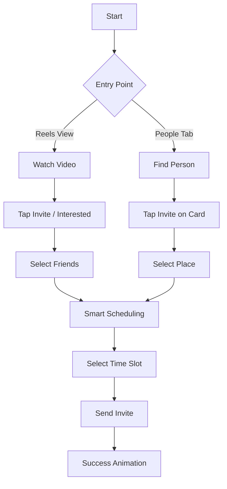

# Luna Social Redesign

This project represents a comprehensive redesign of the Luna Social iOS application. The primary objective of this initiative was to bridge the gap between content consumption and real world social interaction. The redesign focuses on reducing friction in the invitation process and creating a more immersive, user centric experience.

## Setup Instructions

### Prerequisites

To run this project, you will need the following environment configuration:

*   Mac computer running macOS Sonoma or later.
*   Xcode 15.0 or later.
*   iOS 17.0 SDK or later.

### Installation

1.  Clone the repository to your local machine.
2.  Open the `luna-social-demo.xcodeproj` file in Xcode.
3.  Wait for Xcode to index the project and resolve any local package dependencies.
4.  Select a simulator (e.g., iPhone 15 Pro) or a connected physical device.
5.  Press `Cmd + R` or click the Run button to build and launch the application.

## Architecture and Design

### Architectural Decisions

The application is built using **SwiftUI**, leveraging its declarative syntax for building complex, state driven user interfaces.

*   **Modular Component Design**: The UI is broken down into reusable components (e.g., `PersonCardView`, `PlaceCardView`). This promotes code reusability and maintainability.
*   **Navigation Stack**: A custom navigation implementation is used to manage deep linking and context preservation, particularly when transitioning between the immersive video feed and the invitation flows.
*   **State Management**: The app utilizes `ObservableObject` and `@State` properties to manage data flow efficiently, ensuring that UI updates are reactive and performant.

### Design Decisions

The redesign is grounded in the philosophy of **Digital Minimalism**. The goal was to remove unnecessary UI clutter to allow the content to stand out.

*   **Immersive Viewing**: The `ReelsView` features a "Hide UI" toggle, allowing users to consume content without distraction.
*   **Context Preservation**: Instead of navigating away from content to perform actions, interactions like invites are presented in sheets. This keeps the user grounded in their current context.
*   **Smart Scheduling**: To solve the friction of coordination, the `InviteSchedulingView` integrates availability logic directly into the flow, suggesting times that work for all participants.
*   **Person First Flow**: The application supports a bidirectional invitation flow. Users can start with a place and invite people, or start with a person and select a place.

### System Flow Diagram

The following diagram illustrates the user flow for the two primary invitation methods implemented in this redesign.

## Development Process

### AI Assistance

This project utilized advanced coding agents to assist with the refactoring and implementation of complex features. The agents were instrumental in:

*   Refactoring the `RestaurantInviteView` to support the new navigation flow.
*   Implementing the `InviteSchedulingView` with mock smart scheduling logic.
*   Creating the `PlaceSelectionView` to enable the person to place invitation flow.
*   Generating the success animations and UI polish.

### Third Party Resources

*   **SF Symbols**: Used extensively for iconography to ensure a native and consistent iOS aesthetic.
*   **SwiftUI**: The core framework used for all UI development.
*   **Mock Data**: Custom data services were created to simulate backend responses for users and places.
